<!-- @format -->

# Team Dashboard Generator

## Generate a Stylish HTML Dashboard for a Team

Add employees or customize theme colors via the command line

# Table of Contents

- [Installation](#installation)
- [Usage](#usage)
- [License](#license)
- [Contributing](#contributing)
- [Tests](#tests)
- [Questions](#questions)

# Installation

- clone repository
- run `npm i` for dependencies

# Usage

[Walkthrough Video](https://drive.google.com/file/d/1KIdfNCp1l66WatObcvk10h9CovQNAzz9/view?usp=sharing)

- run `npm start` or `node index.js` to begin prompts
- add new employees, or select from previously entered employees
- when finished, html and css are stored in `/dist/*`

## First Run

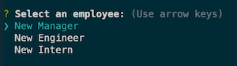

## Has `dist/cache.json` But No HTML or CSS

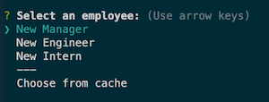

## Subsequent Runs

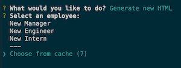

## Cache Count

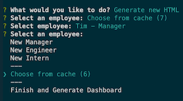

## Finalize and Generate HTML

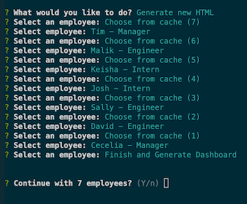

## Select filename

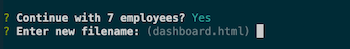

## Confirm overwrite if applicable

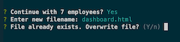

## Customizing Colors

You can change the basic colors and a new `/dist/style.css` will be generated

- _IF_ you already have a stylesheet in `/dist` you can customize colors
- run `node index.js` to begin
- choose `Customize colors` and select the colors you want to change
- enter any valid css color (ie: `white`, `#fff`, `rgb(250,250,250)`)
- choose `Reset colors` if you would like the original stylesheet back

## Select which if any colors you want to change

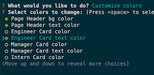

## Set color using any valid CSS color (default for each color is the _current_ color)

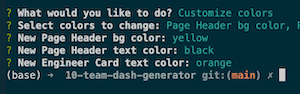
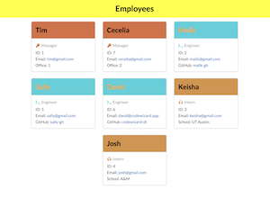

## Reset colors

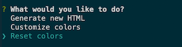
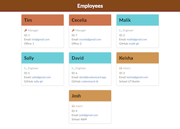

# License

This project is provisioned under the [MIT License](https://opensource.org/licenses/MIT)

# Contributing

[Repo link](https://github.com/codewizard-dt/team-dash-generator)

Do you want to help make this project better? Visit the the repo to check out existing issues or create a new branch to start working on a suggested feature

# Tests

Tests are available in `/test` folder

- Tests Employee classes (Manager, Engineer, Intern)
- Tests HtmlTemplate class
- Tests JsonCache class

# Questions

If you have any questions, please contact me on [Github](https://github.com/codewizard-dt) or [email](mailto:david@codewizard.app).
